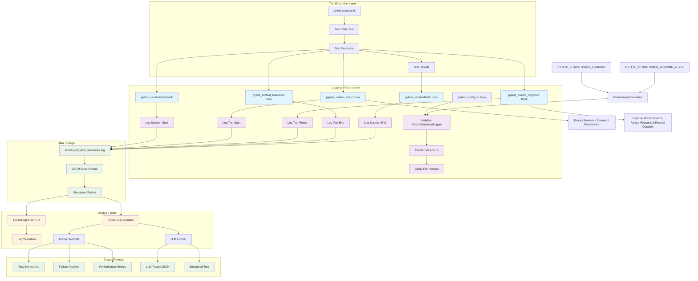

# Testing
Testing framework implement via Python and Bash (_leveraging native Terraform capabilites_). TBD if native Terraform testing capabilities will be used.


## Necessary packages for testing
```bash
pip install pytest
pip install pyyaml
pip install testcontainers
pip install testcontainers[postgres]
```


## WARNING
If you have pytest enabled in VSCode (_via `.vscode.settings.json` > `"python.testing.pytestEnabled": true`), the lifecycle hooks present in `tests/conftest.py` while pick up the test [collection process VSCode runs in the background](https://stackoverflow.com/questions/75481879/multiple-pytest-sessions-during-tests-run), making it look like TWO pytest sessions are running (_instead of the expected one_).
This took MANY hours to figure out. Don't get caught by it too.

## Testing Scopes
###  Local Testing (Plan-Only)
Run tests as far left as possible (_e.g. no reliance on spawned infrastructure_). Cache results for faster `n+1` iterations. Idea is to run this suite often (_to validate bother human- and agent-generated code_), so they need to be comprehensive and execute quickly.

Currently used for:

- `tests/unit/test_module_connection_strings`: Generate values entirely from `terraform.tfvars` / SSM secrets / mocks only.
- `tests/unit/test_logging`: Ensure pytest testcases are logging to an LLM-friendly centralized log file.

### Minimal Deployment Testing (Targeted Apply)
Run tests which have a minor dependency on infrastructure (_e.g. existence of a VPC_) but do not require heavier deployments like EICE & RDS.

Currently used for:

- `tests/unit/config_files`: Generate templated config file with minimum dependency on infrastructure.

### Full Deployment Testing
Run full-sized deployments to validate permutations. TBD how to implement but current thinking supports GHA Matrix operation.


## Structured Logging for LLM Analysis

The testing framework includes comprehensive structured logging that captures pytest execution data in JSON Lines format, making it accessible to LLM Agent-type tooling for analysis, debugging, and automated insights.

### Core Components
**NOTE:** Solution was generated with Claude Code. It built using OOP rather than functional (_like rest of project_). May refactor into future to align better to project standards. (_July 14, 2025_)

- Structured Logger (`tests/utils/pytest_logger.py`)
  - `PytestStructuredLogger` class manages core logging functionality.
  - Creates unique session IDs for each test run via UUIDs.
  - Writes JSON Lines format (one JSON object per line) to `tests/logs/pytest_structured.log`.
  - Supports configurable log levels and can be enabled/disabled via environment variables:
    - `PYTEST_STRUCTURED_LOGGING`
    - `PYTEST_STRUCTURED_LOGGING_LEVEL`
  - Uses Python's logging module with file handlers for reliable output.

  - Pytest Integration (`tests/conftest.py`)
    - Implements pytest hooks that automatically capture test lifecycle events:
        - `pytest_configure`: Initializes the logger at session start
        - `pytest_sessionstart`: Logs session metadata (total tests, markers, Python version)
        - `pytest_sessionfinish`: Logs session summary (passed/failed/skipped counts, duration)
        - `pytest_runtest_setup`: Logs individual test start with metadata (markers, fixtures, parameters)
        - `pytest_runtest_teardown`: Logs individual test completion
        - `pytest_runtest_logreport`: Logs detailed test results (status, duration, output, failure reasons)

  - Log Analysis Tools (tests/utils/)
    - `PytestLogFormatter`: Formats raw log data into human-readable reports and LLM-friendly structures.
    - `PytestLogParser`: CLI tool with commands for validation, summarization, failure extraction, and LLM formatting.
    - Both tools support filtering by recent entries and provide multiple output formats.

### Mermaid Diagram



### Log File Locations

- **Main log file**: `tests/logs/pytest_structured.log`


### Log Mechanics & Format

- **Log format**: JSON Lines (one JSON object per line)
- **Automatic logging**: Enabled by default for all pytest runs
- **Comprehensive Capture**:** Records test paths, durations, markers, fixtures, parameters, output, and failure details

- Each log entry contains:
    - **timestamp**: ISO 8601 UTC timestamp
    - **test_session_id**: UUID identifying the pytest session
    - **event_type**: Type of event (session_start, session_end, test_start, test_end, test_result)
    - **test_path**: Full test path (e.g., `tests/unit/test_example.py::test_function`)
    - **status**: Test outcome (PASSED, FAILED, SKIPPED, ERROR)
    - **duration**: Execution time in seconds
    - **metadata**: Test markers, fixtures, and parametrization info
    - **failure_reason**: Detailed error information for failed tests

### Analyzing Test Patterns

Use the log parsing utilities to extract insights:

```bash
# View human-readable test summary
python tests/utils/log_parser.py summarize

# Extract failed tests with failure reasons
python tests/utils/log_parser.py extract-failures

# Get LLM-friendly formatted output
python tests/utils/log_parser.py llm-format --recent 100

# Validate log file format
python tests/utils/log_parser.py validate

# Export structured data as JSON
python tests/utils/log_parser.py export-json
```

### LLM Integration Examples

The structured logs enable LLM tools to:
- Identify patterns in test failures
- Analyze performance bottlenecks
- Suggest optimizations based on test execution data
- Generate reports on test coverage and reliability
- Provide debugging assistance for failing tests

Example LLM queries:
- "Which tests are failing most frequently?"
- "What are the performance characteristics of database tests?"
- "Are there patterns in the failure reasons?"
- "Which test markers have the highest failure rates?"

### Environment Variables

- `PYTEST_STRUCTURED_LOGGING`: Enable/disable logging (`true`/`false`, default: `true`)
- `PYTEST_LOG_FILE`: Override default log file path

### Log Management

- **Rotation**: Logs append to existing files; implement rotation as needed
- **Size**: Monitor log file size to prevent disk space issues
- **Retention**: Archive old logs for historical analysis
- **Privacy**: Ensure no sensitive data is logged in test output