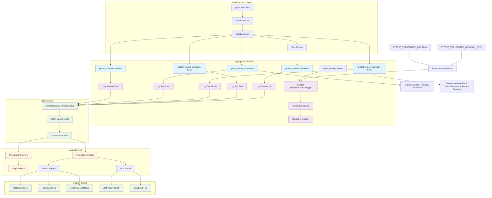

# Testing Framework

## Background
We need a way to quickly test project changes **locally** to (1) speed up the development loop and (2) minimize the cost of operations. Finding a solution proved to be more difficult than originally anticipated, however:

- Considered native [Terraform test](https://developer.hashicorp.com/terraform/tutorials/configuration-language/test), but it felt heavy and clunky compared to a full-fledged programming language.

- Considered [Terratest](https://terratest.gruntwork.io/), but decided against it since I did not want to have to learn a new framework AND introduce Golang into the project.

- Attempted a [tftest](https://pypi.org/project/tftest/), but found it complicated and under-documented, and eventually gave up out of frustration. 

Needing to get something built, the decision was eventually make to build a home-rolled stack using technologies familiar to the CX team (_Python, Bash, Terraform_). Time shall tell if this was a good idea.


## Goals
There are two overarching goals that the testing framework must accommodate:

1. Local Execution (Fast & Targeted)
2. Remote Execution (Comprehensive Matrix)

Current as of Dec 2025, all focus has been on the **local execution** component, as this meets the most immediate need to ensure that solution refactoring does not inadvertently break one of the many configuration files upon which the solution relies (_Seqera Platform config, Ansible, etc_).

**Remote execution** will be tackled in early 2026 when time and attention allow. See [`remote/brainstorm-2025-08-24.md`](./remote/brainstorm-2025-08-24.md) to get a sense for the approach being mooted.


## Challenges & Design Response
### Challenges
#### Challenge 1 - Terraform CLI Speed
Terraform's performance is often describes as _"moderate to slow"_, especially when compared to other IAC solutions.

Client deployments are rare enough (_i.e. usually only when upgrading / redeploying_), that speed has never been a concern. When considered from a test framework facet, however, speed is **critical** consideration: _if the test suite is slow it is likely to be run infrequently (_at best_) and therefore raises the risk of bugs not being caught until much later in the development process.

#### Challenge 2 - (New) Client-Aligned Development
The development team have our own curated `terraform.tfvars`, which are organically updated through a development cycle. Existing clients using this solution also have already-configured `terraform.tfvars` files. It is rare to see either of these stakeholder start from scratch (_i.e. `TEMPLATE_terraform.tfvars`_) during a deployment.

**New** clients, however, do not have this luxury and must start from `TEMPLATE_terraform.tfvars`. The development team must ensure that published TEMPLATE file is properly updated and configured, despite not being consumers of this file. 

#### Challenge 3 - Long-tail Deployments
Multiple clients are using this tool, across a range of Seqera Platform versions and AWS deployment permutations. As a result, old configuration options must be retained and tested even as new features / modifications are added.

### Design Response
In response to the challenges listed above, the following design decisions were made when implementing the testing framework:

| `#` | Decision | Reasoning |
| --- | -------- | --------- |
| 1.  | Test in same project directory as real deployments | This ensures we are as closely aligned to the code artefacts and deployment flow that we expect project users to follow. |
| 2. | Generate base testing artefacts from user-facing assets. | The base `terraform.tfvars` using during testing a dynamically-copied at runtime copy of the `templates/TEMPLATES_terraform.tfvars` file. Similarly, templated secrets objects used to provide the structure for local secret simulation. 

TO DO - continue to document.
"""
EXPLANATION
=======================================

1. Test in the project directory.
2. Take a backup of the existing `terraform.tfvars` file.
3. Create a new testing artifacts:
    - Core (via `tests/datafiles/generate_core_data.sh`):
        - `terraform.tfvars` generate from `templates/TEMPLATE_terraform.tfvars.
        - `base-overrides.auto.tfvars` to generate REPLACE_ME substitutions and set some values for faster baseline testing.
    - Testcase:
        - Generate a new `override.auto.tfvars` file in the project root based on necessary overrides for each test.
        - Terraform lexical hierarchy means this file trumps same settings in core files.
4. Run tests:
    1. For each test case, run `terraform plan` using test tfvars and override files.
    2. Run assertions.
    NOTE: Results cached when possible (i.e. local) to speed up n+1 test runs. Not always feasible with apply-type tests.

5. When tests are complete:
    - Purge tfvars and override files.
    - Restore the original `terraform.tfvars` to project root.
"""
TODO: Weird way to generated templatefiles.

## Troubleshooting
1. `pytest` execution failing with a message like: `FAILED tests/unit/config_files/test_config_file_content.py::test_baseline_alb_all_enabled - subprocess.CalledProcessError: Command '['terraform', 'console']' returned non-zero exit status 1.`

    This is generally caused by a **missing comma** separating the variables being passed into `templatefile` function calls in [`009_define_file_templates.tf`]. Missing commas won't cause `terraform plan/apply` activites to break, but they will absolutely break the `terraform console` invocation this framework uses to generate templatefiles. 

1. `pytest` execution failing with message like: `FAILED tests/unit/config_files/test_config_file_content.py::test_baseline_alb_all_disabled - subprocess.CalledProcessError: Command 'terraform plan  -out=tfplan -refresh=false && terraform show -json tfplan > tfplan.json' returned non-zero exit status 1.`

    Copy [`tests/datafiles/terraform.tfvars`](../tests/datafiles/terraform.tfvars) & [`tests/datafiles/base-overrides.auto.tfvars`](../tests/datafiles/base-overrides.auto.tfvars) into the **<PROJECT_ROOT>** and run `terraform plan  -out=tfplan -refresh=false && terraform show -json tfplan > tfplan.json` again. You will get a more fulsome error message to debug from.

1. Weird Python auto-linting behaviour.

    The solution has some minor (Python) liniting rules defined in both [`pyproject.toml`](../pyproject.toml) and [`.vscode/settings.json`](../.vscode/settings.json). These are likely the source of conflict with your system rules.


## Setup
### Necessary packages
See [`requirements.txt`](./requirements.txt)


## WARNING
If you have pytest enabled in VSCode (_via `.vscode.settings.json` > `"python.testing.pytestEnabled": true`), the lifecycle hooks present in `tests/conftest.py` while pick up the test [collection process VSCode runs in the background](https://stackoverflow.com/questions/75481879/multiple-pytest-sessions-during-tests-run), making it look like TWO pytest sessions are running (_instead of the expected one_).
This took MANY hours to figure out. Don't get caught by it too.

## Testing Scopes
###  Local Testing (Plan-Only)
Run tests as far left as possible (_e.g. no reliance on spawned infrastructure_). Cache results for faster `n+1` iterations. Idea is to run this suite often (_to validate bother human- and agent-generated code_), so they need to be comprehensive and execute quickly.

Currently used for:

- `tests/unit/test_module_connection_strings`: Generate values entirely from `terraform.tfvars` / SSM secrets / mocks only.
- `tests/unit/test_logging`: Ensure pytest testcases are logging to an LLM-friendly centralized log file.

### Minimal Deployment Testing (Targeted Apply)
Run tests which have a minor dependency on infrastructure (_e.g. existence of a VPC_) but do not require heavier deployments like EICE & RDS.

Currently used for:

- `tests/unit/config_files`: Generate templated config file with minimum dependency on infrastructure.

### Full Deployment Testing
Run full-sized deployments to validate permutations. TBD how to implement but current thinking supports GHA Matrix operation.


## Structured Logging for LLM Analysis

The testing framework includes comprehensive structured logging that captures pytest execution data in JSON Lines format, making it accessible to LLM Agent-type tooling for analysis, debugging, and automated insights.

### Core Components
**NOTE:** Solution was generated with Claude Code. It built using OOP rather than functional (_like rest of project_). May refactor into future to align better to project standards. (_July 14, 2025_)

- Structured Logger (`tests/utils/pytest_logger.py`)
  - `PytestStructuredLogger` class manages core logging functionality.
  - Creates unique session IDs for each test run via UUIDs.
  - Writes JSON Lines format (one JSON object per line) to `tests/logs/pytest_structured.log`.
  - Supports configurable log levels and can be enabled/disabled via environment variables:
    - `PYTEST_STRUCTURED_LOGGING`
    - `PYTEST_STRUCTURED_LOGGING_LEVEL`
  - Uses Python's logging module with file handlers for reliable output.

  - Pytest Integration (`tests/conftest.py`)
    - Implements pytest hooks that automatically capture test lifecycle events:
        - `pytest_configure`: Initializes the logger at session start
        - `pytest_sessionstart`: Logs session metadata (total tests, markers, Python version)
        - `pytest_sessionfinish`: Logs session summary (passed/failed/skipped counts, duration)
        - `pytest_runtest_setup`: Logs individual test start with metadata (markers, fixtures, parameters)
        - `pytest_runtest_teardown`: Logs individual test completion
        - `pytest_runtest_logreport`: Logs detailed test results (status, duration, output, failure reasons)

  - Log Analysis Tools (tests/utils/)
    - `PytestLogFormatter`: Formats raw log data into human-readable reports and LLM-friendly structures.
    - `PytestLogParser`: CLI tool with commands for validation, summarization, failure extraction, and LLM formatting.
    - Both tools support filtering by recent entries and provide multiple output formats.

### Mermaid Diagram



### Log File Locations

- **Main log file**: `tests/logs/pytest_structured.log`


### Log Mechanics & Format

- **Log format**: JSON Lines (one JSON object per line)
- **Automatic logging**: Enabled by default for all pytest runs
- **Comprehensive Capture**:** Records test paths, durations, markers, fixtures, parameters, output, and failure details

- Each log entry contains:
    - **timestamp**: ISO 8601 UTC timestamp
    - **test_session_id**: UUID identifying the pytest session
    - **event_type**: Type of event (session_start, session_end, test_start, test_end, test_result)
    - **test_path**: Full test path (e.g., `tests/unit/test_example.py::test_function`)
    - **status**: Test outcome (PASSED, FAILED, SKIPPED, ERROR)
    - **duration**: Execution time in seconds
    - **metadata**: Test markers, fixtures, and parametrization info
    - **failure_reason**: Detailed error information for failed tests

### Analyzing Test Patterns

Use the log parsing utilities to extract insights:

```bash
# View human-readable test summary
python tests/utils/log_parser.py summarize

# Extract failed tests with failure reasons
python tests/utils/log_parser.py extract-failures

# Get LLM-friendly formatted output
python tests/utils/log_parser.py llm-format --recent 100

# Validate log file format
python tests/utils/log_parser.py validate

# Export structured data as JSON
python tests/utils/log_parser.py export-json
```

### LLM Integration Examples

The structured logs enable LLM tools to:
- Identify patterns in test failures
- Analyze performance bottlenecks
- Suggest optimizations based on test execution data
- Generate reports on test coverage and reliability
- Provide debugging assistance for failing tests

Example LLM queries:
- "Which tests are failing most frequently?"
- "What are the performance characteristics of database tests?"
- "Are there patterns in the failure reasons?"
- "Which test markers have the highest failure rates?"

### Environment Variables

- `PYTEST_STRUCTURED_LOGGING`: Enable/disable logging (`true`/`false`, default: `true`)
- `PYTEST_LOG_FILE`: Override default log file path

### Log Management

- **Rotation**: Logs append to existing files; implement rotation as needed
- **Size**: Monitor log file size to prevent disk space issues
- **Retention**: Archive old logs for historical analysis
- **Privacy**: Ensure no sensitive data is logged in test output